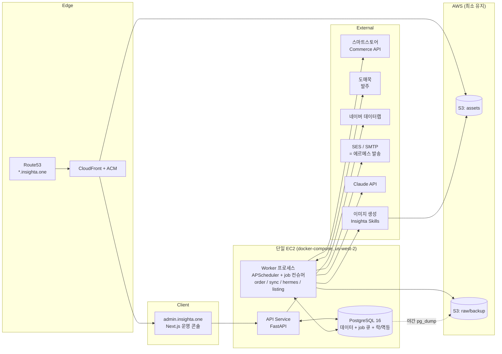
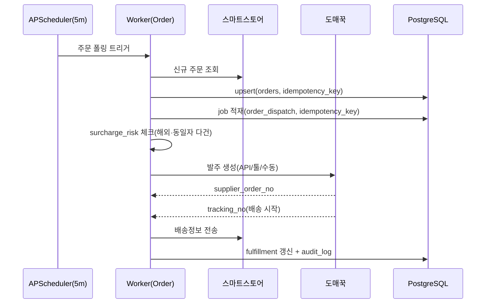
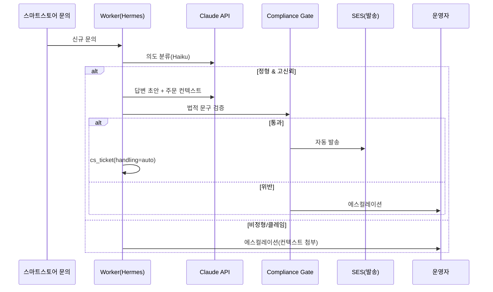

# Design Doc — Insighta Commerce OS (Hermes Ecosystem)

| 항목 | 내용 |
|---|---|
| 문서 상태 | Draft v0.2 — **insighta-shop 경량화 스택** (v0.1의 AWS 매니지드 구성을 1인 MVP 규모로 최적화) |
| 작성일 | 2026-06-03 (v0.2: 2026-06-04) |
| 관련 문서 | `PRD.md`, `BUILD_PLAN.md` |
| 리전 | AWS `us-west-2` (Oregon) |
| 주 도메인 | `shop.insighta.one` (자산/랜딩), `admin.insighta.one` (운영 콘솔) |

---

## 0. v0.2 경량화 결정 요약 (Changelog from v0.1)

1인 운영 MVP에서 운영 부담·비용 대비 과한 컴포넌트를 Postgres 중심으로 통합했다.
**도메인 코어는 어댑터 인터페이스만 보므로, 아래 교체는 전부 어댑터 구현 교체로 가능하다.**

| v0.1 (무거움) | v0.2 (경량) | 업그레이드 트리거 (V1+) |
|---|---|---|
| SQS 큐 | Postgres `job` 테이블 (`FOR UPDATE SKIP LOCKED`) | 잡 처리량 > 수천 건/분, 멀티 호스트 워커 |
| EventBridge 스케줄러 | APScheduler (워커 프로세스 내장). **단일 인스턴스 규약**: 스케줄 잡은 직접 실행하지 않고 멱등키 단 job enqueue만 — 중복 트리거가 나도 정합성은 unique 제약이 보장 | 워커 다중화로 스케줄 중복 실행 위험 시 |
| Redis (ElastiCache) — 락/멱등/캐시 | Postgres advisory lock + unique 제약(멱등키) + 인프로세스 캐시 | 캐시 적중률이 병목, 분산락 경합 증가 |
| KMS 봉투암호화 | 앱 레벨 봉투암호화 (`cryptography` AES-256-GCM, 마스터키는 env) | 운영 인력 증가, 감사 요건 강화 → KMS 전환 |
| Secrets Manager | `.env` (로컬) / EC2 환경변수 주입 (운영) | 시크릿 로테이션 자동화 필요 시 |
| ECS Fargate + RDS + ElastiCache | 단일 EC2 + docker-compose (postgres 컨테이너 포함, 야간 `pg_dump` → S3 백업) | 트래픽/데이터 증가 시 RDS → Fargate 순 전환 |
| LocalStack (로컬 AWS 에뮬레이션) | 불필요 — 로컬 의존성은 **postgres 하나** (S3는 fixture 모킹) | — |

**유지한 것:** S3 + CloudFront(OAC) 자산 서빙(실서빙 필요), Route53/ACM, Claude API 모델 라우팅, 어댑터 격리, 컴플라이언스 게이트, 모든 엔티티 `store_id`.

## 1. 설계 원칙 (Design Principles)

1. **이벤트 기반·비동기 우선.** 주문/발주/CS는 외부 API 지연·실패에 노출되므로 잡 큐 기반으로 분리하고 멱등·재시도를 기본으로 한다.
2. **외부 연동은 어댑터로 격리.** 스마트스토어/도매꾹/송장/메일은 정책이 자주 바뀐다 → 도메인 코어를 어댑터 뒤에 둔다. **인프라(큐/락/암호화/스토리지)도 동일하게 어댑터 뒤에 둔다** — Postgres 구현을 SQS/Redis/KMS로 무중단 교체 가능해야 한다.
3. **AI는 라우팅으로 비용 통제.** 분류=Haiku, 생성=Sonnet, 비싼 추론만 Opus. 캐싱·배치 적극 활용.
4. **컴플라이언스는 코드로 강제.** 위법 문구·규제 카테고리·PII는 미들웨어/게이트로 막는다.
5. **1인 운영 → 멀티 스토어 무중단 확장.** 모든 엔티티에 `store_id`를 1일차부터 둔다.
6. **(v0.2 추가) 운영 가능한 가장 단순한 구조.** 컴포넌트 추가는 측정된 병목이 있을 때만. 기본값은 Postgres로 해결.

## 2. 상위 아키텍처 (High-Level Architecture)



API와 워커는 동일 코드베이스의 두 프로세스(컨테이너). 워커는 APScheduler로 주기 잡(주문 폴링, 재고 동기화, PII 파기)을 등록하고, `job` 테이블을 폴링해 비동기 잡(발주, CS 응답, 콘텐츠 생성)을 처리한다.

## 3. 기술 스택 (Tech Stack)

| 레이어 | 선택 | 근거 |
|---|---|---|
| 운영 콘솔 | Next.js (App Router) | 1인 운영 콘솔, SSR/정적 혼용, 빠른 개발 |
| API | Python 3.12 + FastAPI | AI/데이터 연동 생태계, 타입·검증(Pydantic v2) |
| 워커 | 동일 코드베이스 + APScheduler + `job` 테이블 컨슈머 | 단일 언어·단일 저장소, 브로커 불필요 |
| DB / 큐 / 락 | PostgreSQL 16 (SQLAlchemy + Alembic) | 트랜잭션·관계형 주문 데이터. `SKIP LOCKED` 큐, advisory lock, unique 멱등키까지 겸용 |
| 캐시 | 인프로세스 (functools/cachetools) + Postgres | 1인 규모에서 Redis 불필요 |
| 자산 | S3 + CloudFront(OAC) | 상세/이미지 서빙, shop.insighta.one |
| 비밀 | `.env`(로컬) / EC2 env 주입(운영) | 시크릿 수 적음. V1에서 Secrets Manager |
| PII 암호화 | `cryptography` AES-256-GCM 봉투암호화, 마스터키 env | V1에서 KMS 전환 (인터페이스 동일) |
| 관측 | 구조화 JSON 로그(stdout) + `audit_log` 테이블 | docker logs로 충분. V1에서 CloudWatch agent |
| 배포 | 단일 EC2 + docker-compose + GitHub Actions | 최소 비용·운영 부담. V1에서 Fargate 검토 |
| AI | Claude API (Haiku 4.5 / Sonnet 4.6) | CS 분류·콘텐츠 생성 (6장) |

## 4. 핵심 데이터 모델 (Data Model)

모든 테이블에 `store_id`, `created_at`, `updated_at` 포함.

```text
store(id, name, channel_type[smartstore], credentials_ref)

supplier(id, name, source[domeggook], api_type[api|tool|manual],
         reliability_score, avg_dispatch_hours, stockout_rate)

product(id, store_id, supplier_id, supplier_sku, title, category_code,
        regulated_flag, kc_required, cost_price, sell_price, status)

listing(id, product_id, channel_product_id, detail_html_ref,
        asset_bundle_ref, copy_status, compliance_status, last_synced_at)

asset(id, product_id, type[scenario|model|social|detail],
      s3_key, cdn_url, source[generated|supplier], license_ok)

orders(id, store_id, channel_order_no, product_id, qty, customer_ref,
       status[collected|ordered|shipped|done|cancelled],
       idempotency_key, surcharge_risk_flag)

fulfillment(id, order_id, supplier_order_no, tracking_no,
            carrier, dispatch_status, synced_to_channel)

customer_pii(id, order_id, type[pccc|phone|addr],
             ciphertext, key_version, retain_until)   -- 개인통관고유부호 등

cs_ticket(id, store_id, order_id, channel_inquiry_id, intent,
          confidence, handling[auto|escalated], reply_ref,
          compliance_checked, responded_at)

compliance_rule(id, scope[listing|cs], pattern, action[block|warn], note)

audit_log(id, actor, action, target_type, target_id, payload_ref, at)

job(id, store_id, type[order_dispatch|inventory_sync|hermes_reply|listing_gen|pii_purge],
    payload_json, status[pending|running|done|failed|dead],
    run_after, attempts, max_attempts, last_error,
    idempotency_key UNIQUE, locked_at, locked_by)     -- v0.2: SQS 대체
```

핵심 포인트
- `idempotency_key`(unique 제약)로 주문 중복 수집/발주·잡 중복 적재 방지 — Redis 멱등키 대체.
- `job`은 `SELECT ... FOR UPDATE SKIP LOCKED`로 컨슘. 실패 시 `attempts` 증가 + 지수 백오프 `run_after`, `max_attempts` 초과 시 `dead` (DLQ 대체).
- `customer_pii`는 본문 테이블과 분리, 앱 레벨 봉투암호화(`key_version`으로 키 로테이션 대비), `retain_until` 경과 시 파기 배치.
- `surcharge_risk_flag`: 동일 고객·동일자 다건(해외건 합산과세 위험) 표시.

## 5. 외부 연동 설계 (Integrations)

### 5.1 스마트스토어 (네이버 커머스 API)
- OAuth 자격증명은 env 주입(`store.credentials_ref`로 참조). 상품 등록/수정, 주문 조회, 배송정보 전송.
- 주문 수집: 웹훅 미보장 가정 → **APScheduler 주기 폴링(예: 5분)** 기본, 웹훅 가능 시 보강.
- 레이트리밋·심사 정책 변동 대비 어댑터 격리.

### 5.2 도매꾹 발주
- 우선순위: ① 공식 API → ② 연동툴(스피드고전송기/플레이오토) → ③ 반자동(주문서 생성 후 운영자 확인).
- 어느 경로든 `fulfillment.supplier_order_no`/`tracking_no`를 표준 스키마로 정규화.

### 5.3 송장 동기화
- 공급사/배대지 송장 수신 → 캐리어 코드 매핑 → 스마트스토어 배송정보 전송.

### 5.4 에르메스(메일/문의 발송)
- 발송 채널은 SES(또는 외부 SMTP) 어댑터. 에르메스는 본 시스템의 **발송 레이어**로 통합.
- 입력 계약(오픈이슈): `{ order_context, intent, draft_body }` → 발송. 법적 문구 검증 통과분만 발송.

## 6. AI 파이프라인 (AI Pipeline)

Claude API 모델 라우팅으로 비용·품질 균형. (가격: Haiku 4.5 $1/$5, Sonnet 4.6 $3/$15 per MTok — docs.claude.com)

| 용도 | 모델 | 이유 |
|---|---|---|
| CS 의도 분류 (F5.1) | `claude-haiku-4-5` | 고빈도·저지연·저비용, 분류는 structured output |
| CS 답변 초안 (F5.2) | `claude-haiku-4-5` → 복잡 시 `claude-sonnet-4-6` | 정형은 Haiku, 미묘한 톤은 Sonnet |
| 상세페이지 카피 (F2.1) | `claude-sonnet-4-6` | 콘텐츠 생성 기본 티어 |
| 위법 문구 검증 (F5.4/F6.1) | 룰셋 우선 + `claude-haiku-4-5` 보조 | 결정적 룰 먼저, 회색지대만 LLM |
| 시나리오/모델 이미지 (F2.2) | Insighta `scenario-illustrator` / `x-post-creator` 스킬 | 일관된 스타일, 저작권 안전 |

비용 최적화
- **프롬프트 캐싱**: 시스템 프롬프트·템플릿·few-shot 고정 → 캐시 적중 시 입력 비용 대폭 절감(최대 90%).
- **배치 API**: 야간 대량 상세 생성 등 비실시간 작업은 배치(50% 절감).
- 분류는 structured output(enum)로 토큰 최소화.

> 컴플라이언스 게이트는 LLM 단독 신뢰 금지. **결정적 룰셋이 1차**, LLM은 보조. 청약철회 7일·반품불가 금지 등 위법 패턴은 하드 블록.

## 7. 핵심 시퀀스 (Key Flows)

### 7.1 주문 → 발주 → 송장



### 7.2 인입 CS (에르메스)



## 8. 인프라 & 보안 (Infra & Security)

### 8.1 도메인/자산
- Route53에 `*.insighta.one` 호스팅. ACM 인증서(us-east-1, CloudFront용).
- `shop.insighta.one` → CloudFront → S3(assets). **버킷은 퍼블릭 금지, OAC로만 접근.**
- 버킷 2개: `insighta-assets`(공개 CDN 대상), `insighta-raw`(원본/백업, 비공개).
- 캐시 무효화는 버전드 키(`/<product>/<hash>.webp`)로 회피 — invalidation 비용 절감.

### 8.2 PII (개인통관고유부호 등) — M1 확정 설계

**봉투 구조 (진짜 봉투 — 레코드별 DEK를 마스터 KEK로 래핑, `app/core/security.py`):**

```
blob = [1B fmt=0x01][1B key_version][12B nonce_k][48B wrapped DEK][12B nonce_d][data_ct+tag]
aad  = "insighta-shop:pii:v1:{store_id}:{type}"   # 불변 항목만 (order_id 등 가변 금지)
```

- KEK 교체(로테이션/V1 KMS 전환) = **wrapped DEK 재포장만**, 데이터 재암호화 불필요. `key_version` → KEK 링 매핑이 전환점.
- **nonce 규칙:** 매 암호화마다 `os.urandom(12)`. blob에 저장, 재사용·결정적 파생 금지.
- **에러 정책:** 복호화 실패/KEK 부재/key_version 미스 → 조용한 빈 값 금지, 타입드 예외 + `audit_log`(`pii_decrypt_failed`, 별도 세션 즉시 커밋) 기록. 예외·감사에 평문/키 조각 미포함.

**키-백업 분리 보장 ("백업이 암호문이라 안전"의 전제):**
- KEK는 프로세스 env로만 존재 (운영: `/etc/insighta-shop/secrets.env` 0600, compose `env_file`은 **api/worker 서비스에만** — postgres 서비스 주입 금지).
- KEK는 DB에 어떤 형태로도 저장되지 않음 → `pg_dump` 백업에 구조적으로 포함 불가.
- 회귀 테스트(`tests/test_backup_kek_separation.py`, CI `REQUIRE_PG_DUMP=1` 강제): pg_dump 산출물에 KEK(평문/base64/hex)·PII 평문 미포함 검증.

- 평문 로그 절대 금지: 설계상 어댑터 경계 밖 비노출 + JSON 로그 최종 출력 마스킹 필터(2중 방어).
- `retain_until` 경과 시 파기: 스케줄러가 일일 `pii_purge` 잡 enqueue(멱등키 `pii_purge:{날짜}`) → 워커 처리 + audit_log.
- 개인정보보호법 기준 최소 수집·최소 보존.

### 8.3 시크릿/접근
- 로컬은 `.env`, 운영은 EC2 배포 시 env 주입(GitHub Actions secrets → compose env). 코드/로그/커밋에 평문 금지.
- admin 콘솔은 인증(단일 운영자: 자체 세션 또는 소셜 OAuth — 오픈이슈) + MFA 권장.
- EC2 보안그룹: 80/443만 공개, SSH는 운영자 IP 제한.

### 8.4 관측성
- 구조화 로그(JSON, stdout) → `docker logs` / 파일 로테이션. 외부 발송(메일·발주·상품등록)은 `audit_log` 필수 기록.
- 알람(MVP): 헬스체크 + 주문 폴링 실패·발주 실패·`job.status=dead` 발생 시 운영자 통지(메일/슬랙 webhook). V1에서 CloudWatch.

### 8.5 백업
- 야간 `pg_dump` → `insighta-raw` S3 업로드 (APScheduler 잡). 복구 절차 README에 문서화.
- 업로드 대상은 `*.sql.gz` 단일 아티팩트로 고정(디렉터리 통째 업로드 금지 — env 파일 혼입 차단). 버킷 비공개 + SSE-S3 + 수명주기 30일.

## 9. 비용 개략 (Cost Estimate, 월, 초기 규모)

| 항목 | 개략 |
|---|---|
| EC2 t4g.small~medium (단일) | $15~35 |
| S3 + CloudFront | $5~20 (트래픽 의존) |
| Route53/ACM | ~$1 |
| SES | 발송량 비례, 소액 |
| Claude API | **사용량 비례** — 분류 Haiku($1/$5), 생성 Sonnet($3/$15), 캐싱·배치로 절감 |
| 합계(초기) | **대략 $25~60 + AI 사용량** (v0.1 대비 ~$65~190/월 절감) |

## 10. 배포 & 단계 (Deployment & Phasing)

- **MVP:** 단일 EC2 + docker-compose(api, worker, postgres), S3/CloudFront, APScheduler 폴링. M3/M4/M5 코어 우선.
- **V1:** 측정된 병목에 따라 선택적 승격 — RDS 분리, Redis 캐시, KMS, Secrets Manager, CloudWatch. §0 트리거 표 참조.
- **V2:** 멀티 스토어/채널, 해외구매대행 통관 모듈, SQS/Fargate 전환, (선택) SaaS 멀티테넌시.

CI/CD: GitHub Actions → lint/test → 이미지 빌드 → EC2 배포(compose pull & up). DB는 마이그레이션(Alembic).

## 11. 테스트 전략 (Testing)

- 외부 연동은 **계약 테스트 + 모킹**(스마트스토어/도매꾹/SES 응답 고정 fixture). S3도 fixture 모킹 — LocalStack 불필요.
- 멱등성 테스트: 동일 주문 중복 수집 시 1건만 발주되는지. `job` 중복 적재 시 unique 제약으로 1건만 처리되는지.
- 잡 큐 테스트: 실패 → 백오프 재시도 → `max_attempts` 초과 시 `dead` 전이.
- 컴플라이언스 게이트: 위법 문구 코퍼스로 회귀 테스트(반품불가·청약철회 축소 등 0 통과 보장).
- PII: 로그·응답에 평문 미노출 검증. 암호화 라운드트립 + `key_version` 로테이션 테스트.

## 12. 오픈 이슈 (Open Questions)

1. 도매꾹 발주 경로(API/툴/수동) 확정 → 5.2 구현 분기.
2. 에르메스 입력/발송 계약 규격 확정 → 5.4.
3. 스마트스토어 커머스 API 신청·심사 일정 → 5.1.
4. 1차 카테고리 확정 → M2 템플릿·M6 규제 룰셋 시드.
5. 콘솔 인증 방식(자체 세션 vs 소셜 OAuth) 결정. (v0.1의 Cognito는 경량화로 제외)
